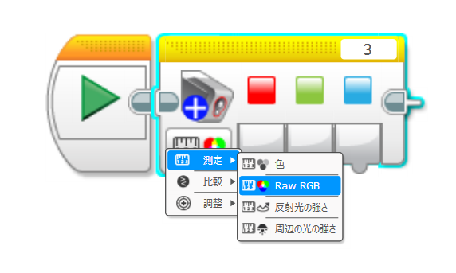
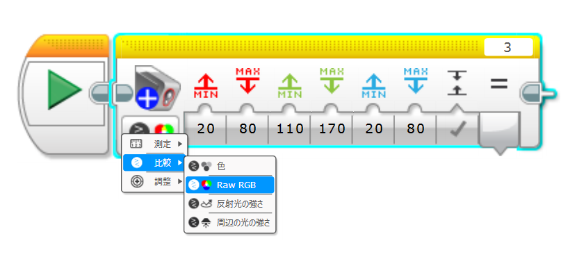
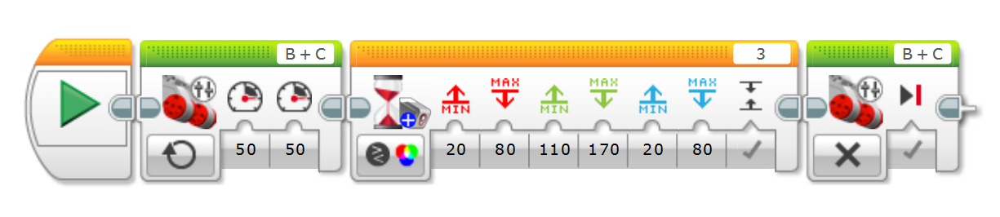

# EV3 ColorSensor PLUS ~EV3 Custom Programming Block~
## 概要
EV3 ColorSensor PLUS は、LEGO MINDSTORMS EV3 向けのカスタムプログラミングブロックです。EV3標準のカラーセンサーでは扱えない「生のRGBデータ取得」や「RGBの範囲による色検出」が可能で、色認識の幅を大きく広げます。

本ブロックでは、以下の2つのモードをサポートしています。

### Raw RGB 測定モード
センサーから読み取った Red / Green / Blue（RGB）の生データ をそのまま出力します。各色の値は 0〜1024 の範囲です。

📷 使用イメージ：

### Raw RGB 比較モード
指定したRGBの範囲と現在のセンサー値を比較し、条件に一致するかどうかを 真偽値（true / false） で出力します。
スイッチブロックやループブロックの条件として使用でき、色に応じた分岐処理が簡単に作れます。

📷 使用イメージ：

## 特徴
✅ RawRGBの取得

EV3標準ブロックでは取得できない生のRGB値を読み取れます。

✅ RGBの範囲による色判定

色の「微妙な違い」まで判定可能。条件付きの色検出に最適です。

✅ 条件ブロックに対応

スイッチブロックやループブロックで色を使った分岐処理ができます。

## インストール方法
- [Releases ページ](https://github.com/namo02268/EV3ColorPLUS/releases)よりColorSensorPLUS.ev3b をダウンロード
- EV3ソフトウェアを起動し、
　[ツール] > [ブロック インポート] を開く
- ダウンロードした .ev3b ファイルを読み込む
- EV3ソフトウェアを再起動
- 追加されたブロックをプログラムにドラッグ＆ドロップして使用

## 使用例
以下は、「ロボットが前進し、緑色 を検出したら停止する」処理の一例です。

📷 プログラム例：

