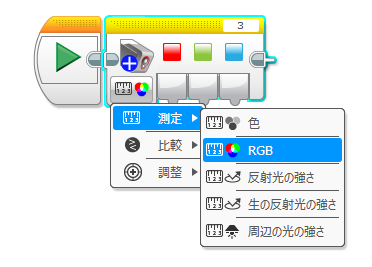
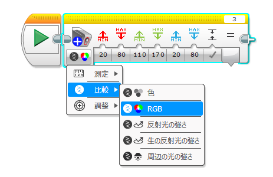
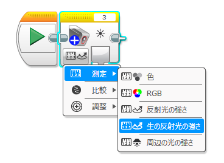
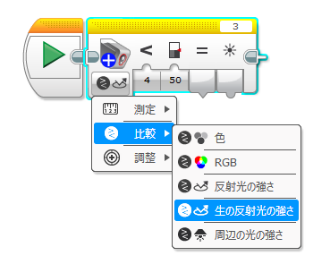
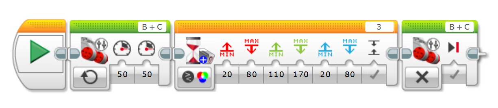

# EV3 ColorSensor PLUS
## 概要
EV3 ColorSensor PLUS は、LEGO MINDSTORMS EV3 向けのカスタムプログラミングブロックです。標準のカラーセンサーブロックでは取得できない **RGBデータ** や **生の反射光の強さ** を取得できるのが特徴です。

本ブロックでは、以下の4つのモードを追加しています。

---
### RGB 測定モード
センサーから読み取った 赤（Red）・緑（Green）・青（Blue） の各チャンネルの値（範囲：0〜1024）をそのまま出力します。カラー情報をより細かく扱いたい場面で役立ちます。

---
### RGB 比較モード
あらかじめ設定したRGBの範囲と現在のセンサー値を比較し、条件に一致すれば true、一致しなければ false を返します。スイッチブロックやループの条件にも使用することができます。

---
### 生の反射光 測定モード
通常の反射光モードは 0〜100% に正規化された値を返しますが、このモードでは、センサーから取得した未加工のADC値 を直接出力します。より広い値の範囲を扱えるため、より細かな変化の検出や滑らかな制御が可能になります。

---
### 生の反射光 比較モード
設定した閾値と比較演算子を使い、生の反射光の値を判定します。

## インストール方法
- [Releases ページ](https://github.com/namo02268/EV3ColorSensorPLUS/releases)より 「EV3ColorSensorPLUS.ev3b」 をダウンロード
- EV3ソフトウェアを起動し、
　[ツール] > [ブロック インポート] を開く
- ダウンロードした .ev3b ファイルを読み込む
- EV3ソフトウェアを再起動
- 追加されたブロックをプログラムにドラッグ＆ドロップして使用

## 使用例
以下は、ロボットが前進し、「緑色 を検出したら停止する」処理の例です。

